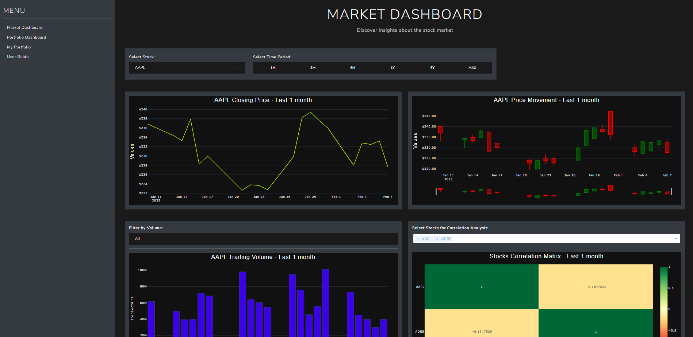

# Stock Market Analytics App

## Overview

Web dashboard built with Plotly Dash for analyzing stock market data and managing a custom portfolio. Data is fetched from the BigQuery dataset prepared using the [StockMarketETL](https://github.com/Alfredomg7/StockMarketETL) data pipeline



## Features

- **Market Dashboard:** Explore stock market insights with interactive line charts, candlestick charts, volume charts, and correlation heatmaps.
- **Portfolio Dashboard:** View key performance indicators (KPIs), portfolio distribution, and sector allocation.
- **Portfolio Form:** Add, edit, and delete stocks with an intuitive user interface.
- **User Guide:** Access a glossary of terms, data source information, and an overview of the dashboard sections.
- **Automated Data Updates:** Daily updates of stock data from Yahoo Finance stored in BigQuery
- **Responsive Design:** Built with Dash and Bootstrap for a user-friendly experience across devices.

## File Structure

- **app.py:** Initializes the Dash app, sets up routes, and registers callbacks.
- **config.py:** Contains configuration settings such as the SQLite database path and CSV file path for sector data.
- **components/**: Reusable UI components (alerts, charts, inputs, tables, etc.).
- **guide/**: Layout for the User Guide section.
- **market_dashboard/**: Layout and callback definitions for the Market Dashboard.
- **portfolio_dashboard/**: Layout and callback definitions for the Portfolio Dashboard.
- **portfolio_form/**: Layout and callback definitions for managing the custom portfolio.
- **services/**: Modules for database operations (`db.py`) and portfolio management (`portfolio.py`).
- **tests/**: Contains unit tests for portfolio services.
- **utils/**: Utility modules for callback handling, database utilities, and figure styling.


## ⚙️ Installation

### Local Installation

1. Clone the repository:
   ```bash
   git clone https://github.com/Alfredomg7/StockMarketAnalytics.git
   cd StockMarketAnalytics
   ```

2. Install dependencies:
   ```bash
   pip install -r requirements.txt
   ```

3. Configure your BigQuery credentials in `.env` file:
```
# Set up your BigQuery credential variables in .env
TYPE = 'service_account'
PROJECT_ID = 'your-project-id'
PRIVATE_KEY_ID = 'your-private-key-id'
PRIVATE_KEY = 'your-private-key'
CLIENT_EMAIL = 'your-client-email@example.com'
CLIENT_ID = 'your-client-id'
AUTH_URI = 'https://accounts.google.com/o/oauth2/auth'
TOKEN_URI = 'https://oauth2.googleapis.com/token'
AUTH_PROVIDER_X509_CERT_URL = 'https://www.googleapis.com/oauth2/v1/certs'
CLIENT_X509_CERT_URL = 'your-client-cert-url'
UNIVERSE_DOMAIN = 'googleapis.com'
DATASET_ID = 'your_dataset_name'
STOCKS_TABLE_ID = 'your_stocks_table_name'
SECTORS_TABLE_ID = 'your_sectors_table_name's
```

### Docker Installation

1. Build the Docker image:
   ```bash
   docker build -t stock-market-etl .
   ```

2. Run the container with environment variables:
   ```bash
   docker run -it --env-file .env stock-market-etl
   ```

## Acknowledgments

- This project uses prepared data from `yfinance` library stored in a BigQuery dataset feeded by the [StockMarketETL](https://github.com/Alfredomg7/StockMarketETL) data pipeline

- Thanks to the developers of Dash, Plotly, and other open-source libraries that made this project possible.

```